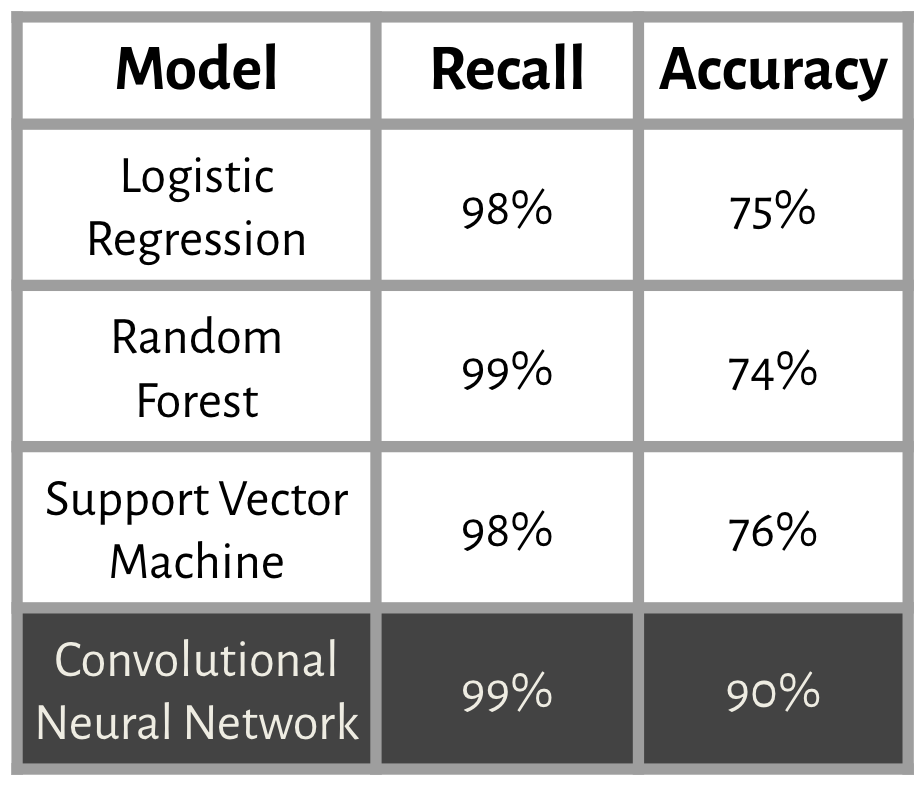

# Helping Humanitarian Aid Workers Identify Pediatric Pneumonia

Classifying pneumonia from X-ray images taken at the Guangzhou Women and Children's Medical Center

## **Introduction**

Pneumonia is the single deadliest disease for children across the planet. This is especially true in developing nations in Southeast Asia and Sub-Saharan Africa, where many countries are dealing with a shortage of available doctors. Our client, the American Red Cross, is interested in easing the burden on medical professionals in these environments by developing new tools to identify pneumonia and flag children who are most at risk. They have asked us to train a model that is able classify the presence of pneumonia in a dataset of pediatric x-rays. These model predictions can then be verified by medical specialists and the children can be treated accordingly. 

## **Exploratory Data Analysis**

This dataset was published in 2018 and consists of around 6,000 chest x-rays taken of children ages 1 through 5. These were taken at the Guangzhou Women and Children's Medical Center and collected, cleaned, and published by researchers at UC San Diego. The labels for the images were verified separately by 3 medical experts. Examples from this dataset are shown below in *Figure 1*:

> *Figure 1*

## **Data Augmentation**

Because of the limited size of this dataset, and the fact that machine learning models thrive on more data, we decided to use augmentation to increase the number of training examples available to our model. Images we flipped horizontallly and rotated by a random angle of ± 20 degrees. These augmentations are shown in *Figure 2*:

> *Figure 2*

## **Performance Metrics**

In order to judge the performance of our model, we decided on two metrics:

### **Recall**

Our first performance metric is recall- a measure of our model's true positive rate. We would like our recall to be high, to maximize the probability that if someone truly has pneumonia, the model predicts this correctly and flags them for a medical follow-up.

### **Accuracy**

Our second performance metric is accuracy- a measure of how many of our model's predictions are correct in total. Simply predicting every child has pneumonia would result in a 100% recall score, which is obviously not helpful in this context. We want to maximize accuracy so that we avoid a large false positive rate that does not reduce the strain on medical staff who are already spread too thin. 

## **Model Selection**

We fit many different models to our data in order to find the most effective solution. *Figure 3* below shows a table of the performance metrics of various models. 

> *Figure 3*

All models performed exceedingly well in regards to recall, but where the convolutional neural network shines is in it's overall accuracy. This is important in reducing those false positives, and thus it is the model we chose to pursue for this problem. 

## **Final Model**

*Figure 4* shows the confusion matrix for our final XGBoost model's performance on our test data set:

> *Figure 4*

### **Final Recall Score**

As you can see, our model only misclassified 1 single person as having no serious injury. This is a recall of 99.9%, meaning a device using this model would be able to automatically dispatch an ambulance for almost everyone who needs one. 

### **Final FPR**

Out of 115,558 people in the test set who were not seriously injured in their accidents, our model misclassified 21.5%. This means around 1 in 5 people who's injuries are not incapacitating will be flagged for potential EMS response. However, we believe this is an acceptable number and our proposed solution in the recommendation section addresses this concern directly. 

## **Conclusions & Recommendations**

We find that XGBoost provides the optimal balance between recall and false positive rate. This model also proves that the proposed device would indeed have the neccessary predictive power to warrant it's use in our client's new vehicle line. We recommend moving into the prototyping phase with the added caveat of a secondary alert feature to address any potential false positives. This would likely be a notification that appears on the vehicle's display after detecting an accident which asks if any occupants are seriously injured. To decline an automatic EMS response a customer can simply press the cancel button, but if no response is recieved in a certain predetermined time, an ambulance will be dispatched immediately. With these recommendations, we believe that our client will be able to fully satisfy their original business problem of increasing the safety rating of their new line of vehicles.

[Full Jupyter Notebook](https://github.com/ClayHunn/Phase3Project/blob/main/Final.ipynb)  

[Non Technical Presentation](https://github.com/ClayHunn/Phase3Project/blob/main/NonTechnicalPresentation.pdf)  

[Original Dataset](https://data.cityofchicago.org/Transportation/Traffic-Crashes-Crashes/85ca-t3if)

