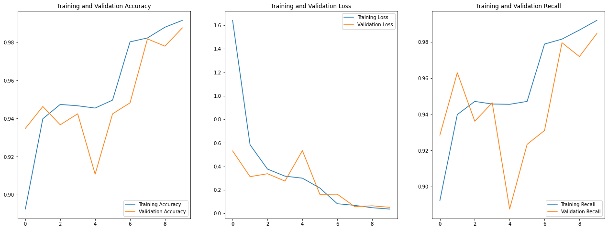
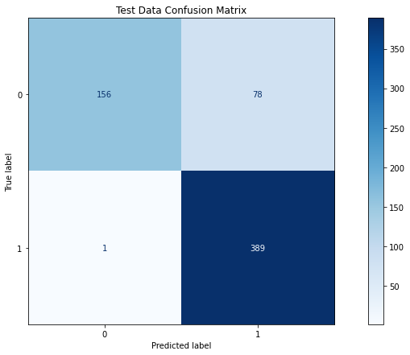

# Helping Humanitarian Aid Workers Identify Pediatric Pneumonia

Classifying pneumonia from X-ray images taken at the Guangzhou Women and Children's Medical Center

## **Introduction**

Pneumonia is the single deadliest disease for children across the planet. This is especially true in developing nations in Southeast Asia and Sub-Saharan Africa, where many countries are dealing with a shortage of available doctors. Our hypothetical client, the American Red Cross, is interested in easing the burden on medical professionals in these environments by developing new tools to identify pneumonia and flag children who are most at risk. They have asked us to train a model that is able to classify the presence of pneumonia in a dataset of pediatric X-rays. These model predictions can then be verified by medical specialists and the children can be treated accordingly. 

## **Exploratory Data Analysis**

This dataset was published in 2018 and consists of around 6,000 chest X-rays taken of children ages 1 through 5. These were taken at the Guangzhou Women and Children's Medical Center and collected, cleaned, and published by researchers at UC San Diego. The labels for the images were verified separately by 3 medical experts. Examples from this dataset are shown below in *Figure 1*:

> *Figure 1*

## **Data Augmentation**

Because of the limited size of this dataset, and the fact that machine learning models thrive when trained on a significant amount of data, we decided to use augmentation to increase the number of training examples available to our model. Images were flipped horizontally and rotated by a random angle of ± 20 degrees. These augmentations are shown in *Figure 2*:

> *Figure 2*

## **Performance Metrics**

In order to judge the performance of our model, we decided on two metrics:

### **Recall**

Our first performance metric is recall- a measure of our model's true positive rate. We would like our recall to be high, to maximize the probability that if someone truly has pneumonia, the model predicts this correctly and flags them for a medical follow-up.

### **Accuracy**

Our second performance metric is accuracy- a measure of how many of our model's predictions are correct in total. Simply predicting every child has pneumonia would result in a 100% recall score, which is obviously not helpful in this context. We want to maximize accuracy so that we avoid a large false positive rate that does not reduce the strain on medical staff who are already spread too thin. 

## **Model Selection**

In order to find the most effective solution, we experimented with many different machine learning algorithms. *Figure 3* below shows a table of the performance metrics of various models. 

> *Figure 3*

All models performed exceedingly well in regard to recall, but where the convolutional neural network shines is in its overall accuracy. This is important in reducing the overall false positive rate, and thus it is the model we chose to pursue for this business problem.

## **Final Model**

Our final model architecture consisted of an Xception model pretrained on the ImageNet dataset, with custom pooling and output layers specific to our binary classification problem. *Figure 4* shows our chosen metrics' evolution by training epoch and *Figure 5* shows the confusion matrix for this model's performance on our test data set:

> *Figure 4*

> *Figure 5*

### **Final Recall Score**

Out of 390 children in the test set with pneumonia, our model was able to recognize 389 of them, for a recall score of over 99%. This left only a single false negative, meaning our model is able to flag almost every child who truly has pneumonia for a follow up with a medical professional. 

### **Final Accuracy**

Out of 594 total children in the test set, our model correctly classified 545. This high accuracy is important for reducing our false positives and ensuring that valuable medical resources are budgeted correctly for those in need. 

## **Conclusions & Recommendations**

We find that our convolutional neural network provides the optimal predictive power for this business problem. We believe this model will indeed help humanitarian aid workers use their valuable medical resources more efficiently. Doctors can be deployed where they are most needed, and the children in need of aid can be identified more quickly. We recommend this system not as a replacement for a medical professional's opinion, but as a supplement to these resources and a technique to help filter through what is currently too much data. 

[Full Jupyter Notebook](https://github.com/LindstromKyle/Image-Classification-of-Childrens-Chest-X-rays/blob/main/code/FINAL_NOTEBOOK.ipynb)  

[Non Technical Presentation](https://github.com/LindstromKyle/Image-Classification-of-Childrens-Chest-X-rays/blob/main/Non%20Technical%20Presentation.pdf)  

[Original Dataset](https://data.mendeley.com/datasets/rscbjbr9sj/2)

