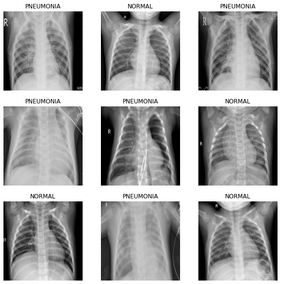
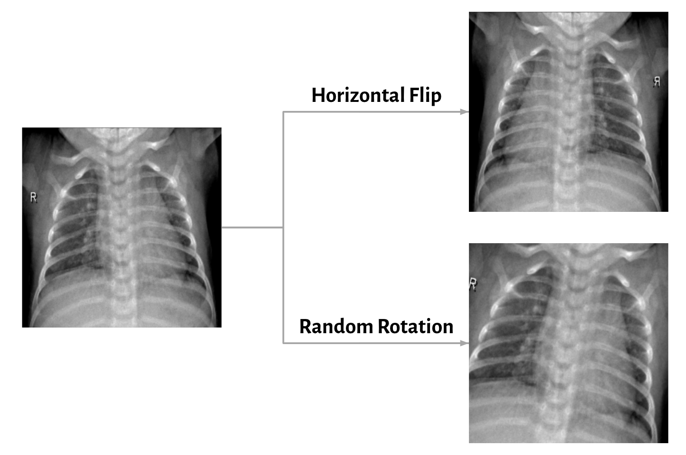

# Helping Humanitarian Aid Workers Identify Pediatric Pneumonia

Classifying pneumonia from X-ray images taken at the Guangzhou Women and Children's Medical Center

## **Introduction**

Pneumonia is the single deadliest disease for children across the planet. This is especially true in developing nations in Southeast Asia and Sub-Saharan Africa, where many countries are dealing with a shortage of available doctors. Our client, the American Red Cross, is interested in easing the burden on medical professionals in these environments by developing new tools to identify pneumonia and flag children who are most at risk. They have asked us to train a model that is able classify the presence of pneumonia in a dataset of pediatric x-rays. These model predictions can then be verified by medical specialists and the children can be treated accordingly. 

## **Exploratory Data Analysis**

This dataset was published in 2018 and consists of around 6,000 chest x-rays taken of children ages 1 through 5. These were taken at the Guangzhou Women and Children's Medical Center and collected, cleaned, and published by researchers at UC San Diego. The labels for the images were verified separately by 3 medical experts. Examples from this dataset are shown below in *Figure 1*:

> *Figure 1*

## **Data Augmentation**

Because of the limited size of this dataset, and the fact that machine learning models thrive on more data, we decided to use augmentation to increase the size of our training examples. Images we flipped horizontallly and rotated by a random angle of ± 20 degrees. These augmentations are shown in *Figure 2*:

> *Figure 2*

## **Performance Metrics**

In order to judge the performance of our model, we decided on two metrics:

### **Recall**

Our first performance metric is recall- a measure of our model's true positive rate. We would like our recall to be high, to maximize the probability that if someone is seriously injured in a crash, the model predicts this correctly and flags them for a potential EMS response.

### **False Positive Rate**

Our second performance metric is false positive rate (FPR)- a measure of how often our model misclassifies people as seriously injured when their injuries are non-incapacitating or there are no injuries at all. We want to minimize our FPR so that we avoid sending an ambulance to every minor fender bender in chicago.

## **Baseline Model**

In order to emulate the status quo we implemented a dummy classifier which defaulted to always predicting the majority class- no injury. This model's confusion matrix is shown in *Figure 2:*

  

> *Figure 2*

This model is clearly ineffective- both the recall and FPR are zero, akin to having no device in the car at all. However, it will serve as a useful measuring stick to judge the improvements of our final model. 

## **Model Selection**

We fit our data to many different models in order to find the most effective solution. *Figure 3* below shows a table of the performance metrics of various models after tuning the relevant hyperparameters:

> *Figure 3*

All except the baseline model preformed exceptionally well, and due to the virtual tie between random forest and XGBoost, we used the average fit time benchmark to decide on XGBoost as our final choice. 

## **Final Model**

*Figure 4* shows the confusion matrix for our final XGBoost model's performance on our test data set:

> *Figure 4*

### **Final Recall Score**

As you can see, our model only misclassified 1 single person as having no serious injury. This is a recall of 99.9%, meaning a device using this model would be able to automatically dispatch an ambulance for almost everyone who needs one. 

### **Final FPR**

Out of 115,558 people in the test set who were not seriously injured in their accidents, our model misclassified 21.5%. This means around 1 in 5 people who's injuries are not incapacitating will be flagged for potential EMS response. However, we believe this is an acceptable number and our proposed solution in the recommendation section addresses this concern directly. 

## **Conclusions & Recommendations**

We find that XGBoost provides the optimal balance between recall and false positive rate. This model also proves that the proposed device would indeed have the neccessary predictive power to warrant it's use in our client's new vehicle line. We recommend moving into the prototyping phase with the added caveat of a secondary alert feature to address any potential false positives. This would likely be a notification that appears on the vehicle's display after detecting an accident which asks if any occupants are seriously injured. To decline an automatic EMS response a customer can simply press the cancel button, but if no response is recieved in a certain predetermined time, an ambulance will be dispatched immediately. With these recommendations, we believe that our client will be able to fully satisfy their original business problem of increasing the safety rating of their new line of vehicles.

[Full Jupyter Notebook](https://github.com/ClayHunn/Phase3Project/blob/main/Final.ipynb)  

[Non Technical Presentation](https://github.com/ClayHunn/Phase3Project/blob/main/NonTechnicalPresentation.pdf)  

[Original Dataset](https://data.cityofchicago.org/Transportation/Traffic-Crashes-Crashes/85ca-t3if)

